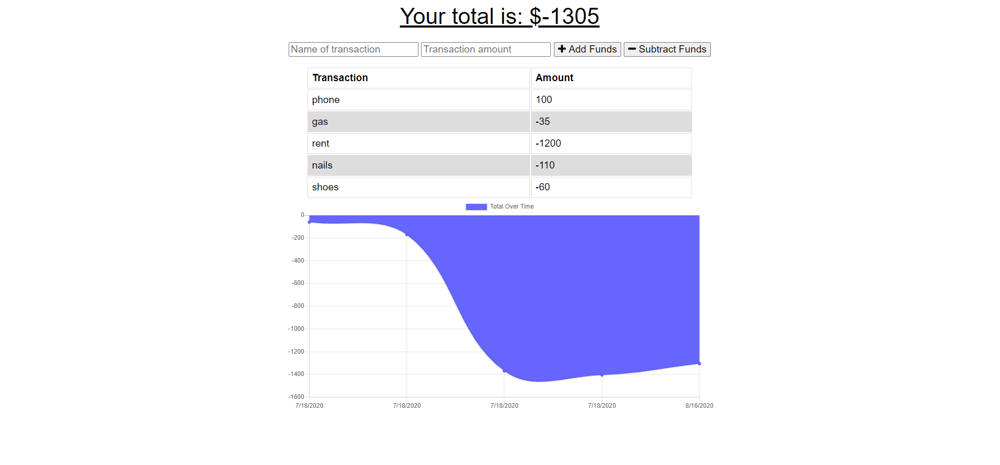

# Budget-Tracker

[Repo: Budget Tracker](https://github.com/Jones-M12/Budget-Tracker)

[Deployed Site: Budget Tracker Jones](https://budgettrackerjones.herokuapp.com/)

## Overview

Expenses tracking application that is setup to use indexDB or service worker. Supports ability to add deductions even offline.

## User Story

As a USER.

I WANT to track how much money I spend.

SO THAT I can stay within my budget.

## Development 

Transitioned application to support offline user functionality. User will be able to add transactions offline, which automatically register when online. 
This makes the application user friendly and enhances the user experience.

Below is an example of what the application may look like:

* Main Screen

* This view display the offline and online functionality 

* In the Dev tools, switch network to offline

* Add despots or expenses

* In the Dev tools, switch network to online.

* See all inputs are added instantly without interupptions to user

## Contact Information

* GitHub: [Jones-M12](https://github.com/Jones-M12) 

* Email: malesharj@gmail.com 

* LinkedIn: [m-jones89](https://www.linkedin.com/in/m-jones89/)
